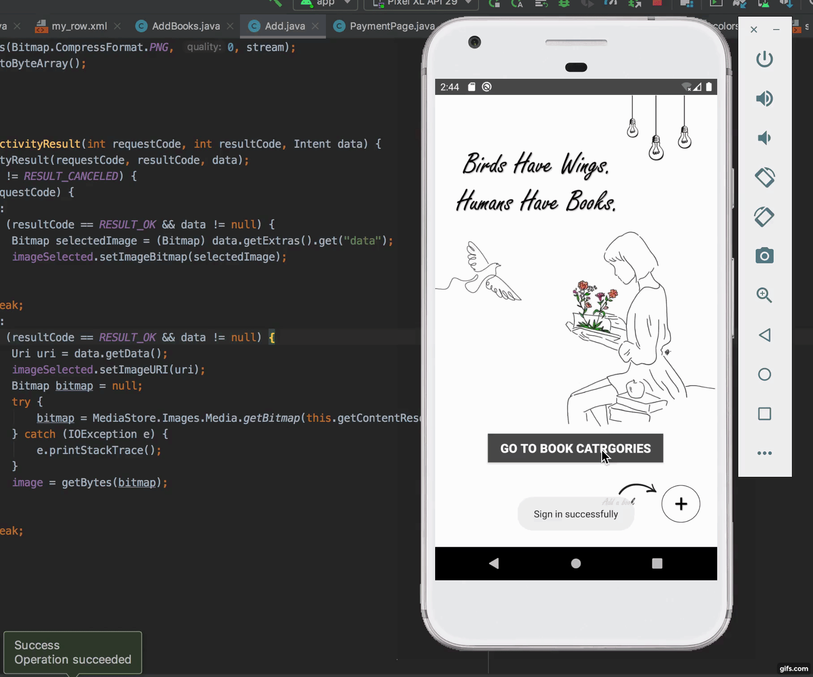

# Let's Swap App

### Project Overview
Let's Swap App enables readers to borrow and lend books with each other. The app collects used books and divides them according to the book's category/genre and then displays them in a clear and simple way as book shelves. The app provides a lending service for free, however, the borrower only has to pay for the shipping fee. 

This is a group project for the academic course: Application development (CS410) - Fall 2020.

### Demo

